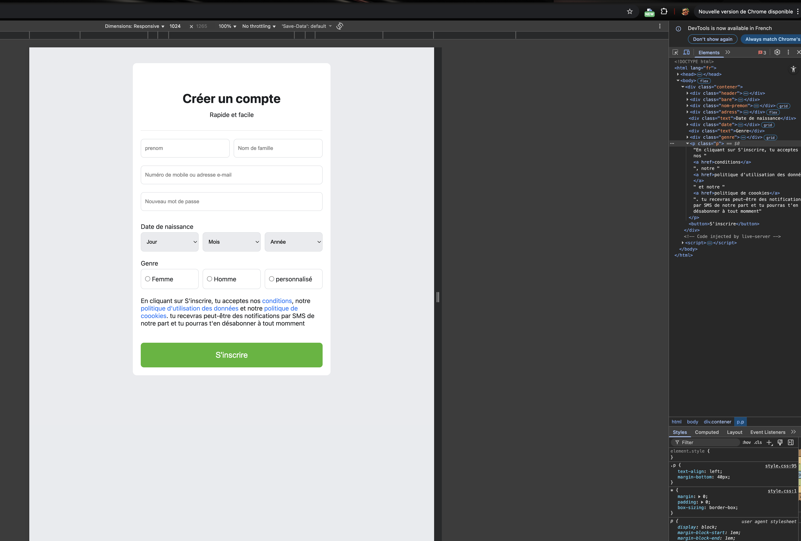

#  Clonage Statique : Formulaire d'Inscription Facebook

## Description du Projet

Ce projet est une **reproduction statique** de la modale ou de la section "Créer un compte" de Facebook. C'est un exercice d'intégration front-end pur (HTML/CSS) visant à recréer la mise en page et le style d'un formulaire d'inscription complexe.

L'objectif principal était de maîtriser le positionnement des éléments de formulaire, y compris les champs de saisie, les listes déroulantes (`<select>`) et les boutons radio, tout en assurant une **expérience utilisateur fluide et un design entièrement Responsive**.

## Fonctionnalités Clés

* **Structure du Formulaire** : Intégration de tous les champs essentiels (Nom, Prénom, Email/Mobile, Mot de passe).
* **Champs Spécifiques** : Listes déroulantes pour la **Date de Naissance** (Jour, Mois, Année) et boutons radio pour la sélection du **Genre**.
* **Design Facebook** : Respect du schéma de couleurs, de la typographie et des styles de bordure caractéristiques de l'interface d'inscription.
* **Mise en Page Moderne** : Utilisation de **CSS Grid** pour organiser les champs en lignes et colonnes (notamment pour Nom/Prénom et Date de Naissance).
* **Design Responsive** : Le formulaire s'adapte parfaitement à toutes les tailles d'écran. Sur mobile ($768\text{px}$), tous les champs et les sélecteurs de date passent sur une seule colonne pour optimiser l'espace vertical.

## Technologies Utilisées

**HTML5** : Structure du formulaire et des options.

**CSS3** : Style de l'interface, Flexbox et CSS Grid pour la mise en page complexe.

**Media Queries** : Adaptation de la disposition des champs (Grid passe de multiples colonnes à une seule colonne sur mobile).

## Démarrage

Pour visualiser ce formulaire :

1.  Assurez-vous que les fichiers `index.html` et `style.css` sont dans le même répertoire.
2.  Ouvrez `index.html` dans votre navigateur web.

## Adaptation Mobile

Le point clé de la réactivité ($768\text{px}$) est l'utilisation des Media Queries pour basculer les mises en page Grid vers une disposition en colonne unique :

* **Nom/Prénom** : Passe de `grid-template-columns: 1fr 1fr` à `1fr`.
* **Date de Naissance** : Passe de `grid-template-columns: 1fr 1fr 1fr` à `1fr`.
* **Genre** : Passe de `grid-template-columns: 1fr 1fr 1fr` à `1fr` (une option de genre par ligne).

